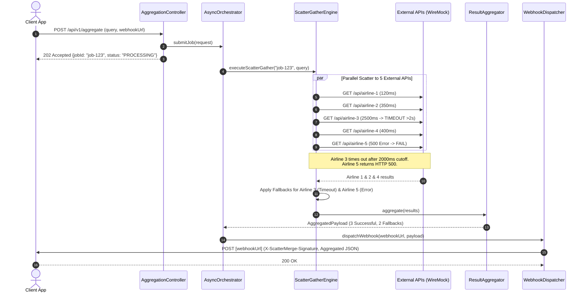
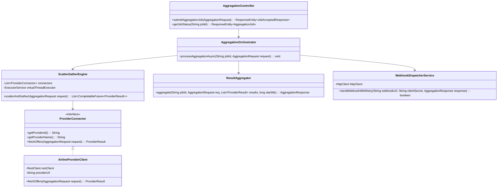

# Asynchronous API Aggregator & Webhook Dispatcher (ScatterMerge)

## System Design Document (HLD & LLD)

---

## 1. Executive Summary & Project Goal

**ScatterMerge** is an enterprise-grade, high-throughput asynchronous API aggregation platform designed using the **Scatter-Gather** pattern, **Java 25 Virtual Threads (Project Loom)**, and **CompletableFuture**.

### Primary Project Goal

To construct a resilient, non-blocking API gateway engine capable of concurrently querying multiple third-party external services (e.g., flight price aggregators, logistics providers, financial tickers), handling unpredictable network latencies and partial partner outages through strict timeout budgets and graceful fallbacks, and delivering unified payload responses asynchronously via secure webhooks.

---

## 2. Problem Statement & Value Proposition

### The Problem

1. **Sequential Latency Bottleneck**: Calling $N$ external partner APIs sequentially leads to an additive latency curve $T_{total} = \sum_{i=1}^{N} t_i$. For example, querying 5 airline APIs taking 400ms each results in a minimum response time of 2.0 seconds.
2. **Cascading Failures & Tail Latency**: If a single partner API hangs or experiences a 10-second spike, the entire upstream client thread blocks, exhausting connection pools and degrading user experience.
3. **HTTP Thread Starvation**: Traditional thread-per-request model (using Platform Threads) starves under high concurrency when threads spend most of their lifecycles waiting on synchronous I/O.
4. **Synchronous Polling Overhead**: Making clients wait synchronously for long-running aggregation tasks drains client-side bandwidth and backend HTTP pool resources.

### The Solution (ScatterMerge Value Proposition)

* **Scatter-Gather Concurrency**: Concurrent fan-out to $N$ providers reduces overall aggregation time to $T_{total} = \max(t_1, t_2, \dots, t_N) + \epsilon$.
* **Non-blocking Timeout & Fallback Boundaries**: Hard deadline enforcement (e.g., 2.0s per provider cutoff). Slow external calls are gracefully dropped and replaced with synthetic fallback data without failing the overall payload.
* **Java 25 Virtual Thread Engine**: Leverages lightweight Virtual Threads (`Executors.newVirtualThreadPerTaskExecutor()`) to handle thousands of concurrent outbound HTTP calls without thread pool exhaustion or memory overflow.
* **Asynchronous Webhook Delivery**: Decouples API processing from client HTTP response. Clients receive an immediate `202 Accepted` response with a `jobId`, and final aggregated data is pushed directly to the client's registered Webhook URL with retry policy and HMAC security signatures.

---

## 3. SaaS Potential & Business Models

ScatterMerge can be productized as a **B2B Integration-as-a-Service (IaaS)** or **API Aggregation Gateway**.

### Target Use Cases

* **Travel & Hospitality Meta-Search**: Aggregating flight rates, hotel room availability, and car rentals from dozens of legacy GDS systems.
* **Fintech & Crypto Rate Engines**: Fetching real-time exchange rates or stock quotes from 10+ financial exchanges simultaneously.
* **E-Commerce & Logistics Tracker**: Combining tracking status across FedEx, UPS, DHL, and local courier APIs.
* **AI Agent Context Retrieval**: Gathering knowledge context across multiple search engines, vector databases, and internal document store APIs simultaneously.

### Revenue & Monetization Strategy

1. **Usage-Based Tiering**: Bill per 1,000 Scatter-Gather dispatches.
2. **SLA & Latency Guarantees**: Higher tier pricing for custom strict SLAs (e.g., 500ms timeout budget with guaranteed fallback SLA).
3. **Webhook Reliability Add-on**: Guaranteed at-least-once webhook delivery with dead-letter queue (DLQ) access and custom payload transformation.
4. **Managed Connectors**: Enterprise subscriptions offering pre-built, authenticated connectors to 100+ standard industry APIs.

---

## 4. High-Level Design (HLD)

### 4.1 System Architecture

The system consists of the following key subsystems:

1. **Ingestion & Validation Layer (REST Controller)**: Validates incoming aggregation requests and enqueues jobs.
2. **Job Queue & Async Orchestrator**: Accepts jobs and dispatches them into the Virtual Thread Task Executor.
3. **Scatter-Gather Engine**: Concurrently executes outbound partner API calls via `CompletableFuture.allOf()` and HTTP Client instances.
4. **Timeout & Circuit Breaker Manager**: Monitors duration of each call, applying strict time limits and returning fallback responses when threshold is breached.
5. **Payload Aggregator & Normalizer**: Merges individual responses, filters out failed/timed-out nodes, normalizes output JSON, and computes metadata (execution time, success rate).
6. **Webhook Dispatcher Engine**: Manages asynchronous HTTP POST delivery of the aggregated result to the client's callback URL with exponential backoff and HMAC-SHA256 signature verification.
7. **WireMock Partner Simulator**: Simulates 5 distinct third-party vendor APIs with controlled delays, deliberate latency spikes, and failure scenarios.

### 4.2 High-Level System Architecture Diagram

```mermaid
flowchart TD
    Client[Client / Client App] -->|1. POST /api/v1/aggregate\n{query, webhookUrl}| Ingestion[API Gateway / Ingestion Layer]
    Ingestion -->|2. Immediate 202 Accepted\n{jobId, status: PROCESSING}| Client
    Ingestion -->|3. Submit Job| Orchestrator[Async Task Orchestrator]

    subgraph ScatterMerge Core Engine
        Orchestrator -->|4. Fan-Out Tasks| VirtualThreadPool[Java 25 Virtual Thread Executor]
      
        subgraph Scatter-Gather Execution Engine
            VirtualThreadPool -->|Parallel Call 1| P1[Provider Connector 1]
            VirtualThreadPool -->|Parallel Call 2| P2[Provider Connector 2]
            VirtualThreadPool -->|Parallel Call 3| P3[Provider Connector 3]
            VirtualThreadPool -->|Parallel Call 4| P4[Provider Connector 4]
            VirtualThreadPool -->|Parallel Call 5| P5[Provider Connector 5]
        end

        P1 -->|CompletableFuture| Aggregator[Aggregator & Normalizer]
        P2 -->|CompletableFuture| Aggregator
        P3 -->|Timeout Exceeded 2s| TimeoutHandler[Fallback & Timeout Handler] -->|Synthetic Fallback| Aggregator
        P4 -->|CompletableFuture| Aggregator
        P5 -->|500 Error| TimeoutHandler -->|Fallback Response| Aggregator
    end

    subgraph External Provider Layer / WireMock Stubs
        P1 <-->|HTTP GET /airline-a| WireMock1[WireMock: Airline A (150ms)]
        P2 <-->|HTTP GET /airline-b| WireMock2[WireMock: Airline B (300ms)]
        P3 <-->|HTTP GET /airline-c| WireMock3[WireMock: Airline C (2500ms - SLOW)]
        P4 <-->|HTTP GET /airline-d| WireMock4[WireMock: Airline D (450ms)]
        P5 <-->|HTTP GET /airline-e| WireMock5[WireMock: Airline E (ERROR 500)]
    end

    Aggregator -->|5. Unified Json Payload| WebhookEngine[Webhook Dispatcher Engine]
    WebhookEngine -->|6. POST Final Payload + HMAC Signature| WebhookReceiver[Client Webhook Endpoint]
```

### 4.3 Component Breakdown

| Component Name                       | Primary Responsibility                                                                                                    | Key Technologies                                                           |
| :----------------------------------- | :------------------------------------------------------------------------------------------------------------------------ | :------------------------------------------------------------------------- |
| **Ingestion Controller**       | Accepts requests, validates JSON body, returns fast HTTP`202 Accepted` with `jobId`.                                  | Spring MVC (`@RestController`), Bean Validation (`Jakarta Validation`) |
| **Scatter-Gather Engine**      | Fans out requests to 5 provider connectors asynchronously using`CompletableFuture.supplyAsync`.                         | Java 25`CompletableFuture`, Virtual Threads Executor                     |
| **Provider Connectors**        | Low-level HTTP clients configured with non-blocking sockets and connection pooling.                                       | Java`HttpClient` / Spring `RestClient`                                 |
| **Timeout & Fallback Handler** | Applies time limits (`orTimeout` / `completeOnTimeout`) per task. Supplies default fallback objects on error/timeout. | Java 25`CompletableFuture` API, Custom Fallback Factory                  |
| **Payload Aggregator**         | Combines successful and fallback results into a standardized response DTO with summary stats.                             | Jackson JSON, Lombok                                                       |
| **Webhook Dispatcher**         | Executes HTTP POST calls to client callback URLs with exponential retry (1s, 2s, 4s) and HMAC signing.                    | Spring`@Async`, Java `HttpClient`, Mac HMAC-SHA256                     |
| **WireMock Simulator**         | Mocks 5 external airline APIs with customizable delays (e.g., 100ms to 3000ms) and status codes.                          | WireMock Server / Spring Cloud Contract WireMock                           |

### 4.4 End-to-End Execution Sequence Diagram



### 4.5 Non-Functional Requirements (NFRs) & Resilience Design

1. **High Concurrency & Low Overhead**:
   - Powered by **Java 25 Virtual Threads**. Unlike platform threads that take ~1MB stack size, virtual threads take ~a few hundred bytes, allowing 100,000+ concurrent requests without memory starvation.
2. **Fault Isolation (Bulkheading)**:
   - Failure or extreme latency in Provider #3 does not affect Providers #1, #2, #4, or #5.
3. **Strict Latency Budget**:
   - Hard timeout boundary of 2,000ms globally per provider call. Total backend aggregation time is capped at $\sim 2050\text{ms}$.
4. **At-Least-Once Webhook Delivery**:
   - Webhook dispatcher retries up to 3 times on `5xx` or network errors using exponential backoff with jitter.
5. **Webhook Security**:
   - Every outgoing webhook POST carries an `X-ScatterMerge-Signature` header calculated using `HMAC-SHA256(payload, client_secret)` to prevent tampering or spoofing.

---

## 5. Low-Level Design (LLD)

### 5.1 Project & Package Structure

```
ScatterMerge/
├── pom.xml
├── src/
│   ├── main/
│   │   ├── java/
│   │   │   └── com/
│   │   │       └── prathamcodes/
│   │   │           └── scattermerge/
│   │   │               ├── ScatterMergeApplication.java
│   │   │               ├── config/
│   │   │               │   ├── AsyncConfig.java
│   │   │               │   ├── HttpClientConfig.java
│   │   │               │   └── WireMockConfig.java
│   │   │               ├── controller/
│   │   │               │   ├── AggregationController.java
│   │   │               │   └── JobStatusController.java
│   │   │               ├── model/
│   │   │               │   ├── dto/
│   │   │               │   │   ├── AggregationRequest.java
│   │   │               │   │   ├── AggregationResponse.java
│   │   │               │   │   ├── JobAcceptedResponse.java
│   │   │               │   │   ├── ProviderResult.java
│   │   │               │   │   └── WebhookPayload.java
│   │   │               │   ├── enums/
│   │   │               │   │   ├── JobStatus.java
│   │   │               │   │   └── ProviderStatus.java
│   │   │               │   └── entity/
│   │   │               │       └── AggregationJob.java
│   │   │               ├── service/
│   │   │               │   ├── AggregationOrchestrator.java
│   │   │               │   ├── ScatterGatherEngine.java
│   │   │               │   ├── ResultAggregator.java
│   │   │               │   ├── WebhookDispatcherService.java
│   │   │               │   └── provider/
│   │   │               │       ├── ProviderConnector.java
│   │   │               │       ├── AirlineProviderClient.java
│   │   │               │       └── FallbackProviderClient.java
│   │   │               └── util/
│   │   │                   └── HmacSecurityUtil.java
│   │   └── resources/
│   │       ├── application.yml
│   │       └── mappings/ (WireMock stubs JSON)
│   └── test/
│       └── java/
│           └── com/
│               └── prathamcodes/
│                   └── scattermerge/
│                       ├── ScatterGatherEngineTest.java
│                       └── WebhookDispatcherIntegrationTest.java
```

### 5.2 Core Data Models & DTOs

#### `AggregationRequest.java`

```java
package com.prathamcodes.scattermerge.model.dto;

import jakarta.validation.constraints.NotBlank;
import jakarta.validation.constraints.NotNull;
import org.hibernate.validator.constraints.URL;

public record AggregationRequest(
    @NotBlank(message = "Origin is required") String origin,
    @NotBlank(message = "Destination is required") String destination,
    @NotBlank(message = "Departure date is required") String departureDate,
    @NotNull @URL(message = "Must be a valid Webhook URL") String webhookUrl,
    String clientSecret
) {}
```

#### `ProviderResult.java`

```java
package com.prathamcodes.scattermerge.model.dto;

import com.prathamcodes.scattermerge.model.enums.ProviderStatus;
import java.math.BigDecimal;
import java.util.List;

public record ProviderResult(
    String providerId,
    String providerName,
    ProviderStatus status, // SUCCESS, TIMEOUT, FAILED_FALLBACK
    long latencyMs,
    List<FlightOffer> offers,
    String errorMessage
) {
    public record FlightOffer(
        String flightNumber,
        BigDecimal price,
        String currency,
        String flightDuration
    ) {}
}
```

#### `AggregationResponse.java`

```java
package com.prathamcodes.scattermerge.model.dto;

import java.util.List;

public record AggregationResponse(
    String jobId,
    String searchSummary,
    long totalExecutionTimeMs,
    int totalProvidersQueried,
    int successfulProvidersCount,
    int fallbackProvidersCount,
    List<ProviderResult> providerResults
) {}
```

### 5.3 Core Class Diagram



### 5.4 Scatter-Gather Engine & Concurrency Design

The `ScatterGatherEngine` is the heart of the system. It dispatches calls to all 5 providers concurrently on Virtual Threads using `CompletableFuture`.

```java
package com.prathamcodes.scattermerge.service;

import com.prathamcodes.scattermerge.model.dto.AggregationRequest;
import com.prathamcodes.scattermerge.model.dto.ProviderResult;
import com.prathamcodes.scattermerge.model.enums.ProviderStatus;
import com.prathamcodes.scattermerge.service.provider.ProviderConnector;
import org.springframework.stereotype.Service;

import java.util.Collections;
import java.util.List;
import java.util.concurrent.CompletableFuture;
import java.util.concurrent.ExecutorService;
import java.util.concurrent.Executors;
import java.util.concurrent.TimeUnit;

@Service
public class ScatterGatherEngine {

    private final List<ProviderConnector> connectors;
    // Java 25 Virtual Thread Executor
    private final ExecutorService virtualThreadExecutor = Executors.newVirtualThreadPerTaskExecutor();
    private static final long TIMEOUT_SECONDS = 2;

    public ScatterGatherEngine(List<ProviderConnector> connectors) {
        this.connectors = connectors;
    }

    public List<ProviderResult> executeScatterGather(AggregationRequest request) {
        // 1. Scatter: Dispatch all tasks in parallel on Virtual Threads
        List<CompletableFuture<ProviderResult>> futures = connectors.stream()
            .map(connector -> 
                CompletableFuture.supplyAsync(() -> connector.fetchOffers(request), virtualThreadExecutor)
                    // 2. Enforce 2-second strict timeout per provider task
                    .orTimeout(TIMEOUT_SECONDS, TimeUnit.SECONDS)
                    // 3. Fallback logic on timeout or exception
                    .exceptionally(ex -> createFallbackResult(connector, ex))
            )
            .toList();

        // 4. Gather: Combine all futures into a single barrier future
        CompletableFuture<Void> allFutures = CompletableFuture.allOf(
            futures.toArray(new CompletableFuture[0])
        );

        // Block non-blocking virtual thread orchestrator until all complete or timeout fallback completes
        allFutures.join();

        // 5. Extract completed results
        return futures.stream()
            .map(CompletableFuture::join)
            .toList();
    }

    private ProviderResult createFallbackResult(ProviderConnector connector, Throwable ex) {
        boolean isTimeout = ex instanceof java.util.concurrent.TimeoutException;
        ProviderStatus status = isTimeout ? ProviderStatus.TIMEOUT : ProviderStatus.FAILED_FALLBACK;
        String errorMsg = isTimeout 
            ? "Provider response exceeded deadline of " + TIMEOUT_SECONDS + "s"
            : "Provider error: " + ex.getMessage();

        return new ProviderResult(
            connector.getProviderId(),
            connector.getProviderName(),
            status,
            TIMEOUT_SECONDS * 1000,
            Collections.emptyList(),
            errorMsg
        );
    }
}
```

### 5.5 Timeout, Circuit Breaker & Fallback Architecture

```
                                  [Outbound Call]
                                         │
                         ┌───────────────┴───────────────┐
                         ▼                               ▼
                 [Responds <= 2s]               [Takes > 2s or 5xx]
                         │                               │
                         ▼                               ▼
                ProviderResult(SUCCESS)       CompletableFuture Catch
                         │                       │ Exception / Timeout
                         │                       ▼
                         │             createFallbackResult()
                         │                       │
                         └───────────────┬───────┘
                                         ▼
                               [Aggregated List]
```

### 5.6 Webhook Dispatcher Engine & Retry Mechanism

The `WebhookDispatcherService` handles asynchronous payload transmission to the client's endpoint with HMAC signature and exponential backoff retry.

```java
package com.prathamcodes.scattermerge.service;

import com.fasterxml.jackson.databind.ObjectMapper;
import com.prathamcodes.scattermerge.model.dto.AggregationResponse;
import com.prathamcodes.scattermerge.util.HmacSecurityUtil;
import lombok.extern.slf4j.Slf4j;
import org.springframework.scheduling.annotation.Async;
import org.springframework.stereotype.Service;

import java.net.URI;
import java.net.http.HttpClient;
import java.net.http.HttpRequest;
import java.net.http.HttpResponse;
import java.time.Duration;

@Slf4j
@Service
public class WebhookDispatcherService {

    private final HttpClient httpClient = HttpClient.newBuilder()
        .connectTimeout(Duration.ofSeconds(5))
        .build();
    private final ObjectMapper objectMapper;

    public WebhookDispatcherService(ObjectMapper objectMapper) {
        this.objectMapper = objectMapper;
    }

    @Async("webhookExecutor")
    public void dispatch(String webhookUrl, String secret, AggregationResponse response) {
        int maxRetries = 3;
        long backoffMs = 1000; // 1s, 2s, 4s

        for (int attempt = 1; attempt <= maxRetries; attempt++) {
            try {
                String jsonBody = objectMapper.writeValueAsString(response);
                String signature = HmacSecurityUtil.calculateHmacSha256(jsonBody, secret);

                HttpRequest httpRequest = HttpRequest.newBuilder()
                    .uri(URI.create(webhookUrl))
                    .header("Content-Type", "application/json")
                    .header("X-ScatterMerge-Signature", signature)
                    .header("X-ScatterMerge-Event", "aggregation.completed")
                    .POST(HttpRequest.BodyPublishers.ofString(jsonBody))
                    .timeout(Duration.ofSeconds(5))
                    .build();

                HttpResponse<String> httpResponse = httpClient.send(
                    httpRequest, 
                    HttpResponse.BodyHandlers.ofString()
                );

                if (httpResponse.statusCode() >= 200 && httpResponse.statusCode() < 300) {
                    log.info("Webhook successfully dispatched to {} on attempt {}", webhookUrl, attempt);
                    return;
                }

                log.warn("Webhook attempt {} to {} returned status {}", attempt, webhookUrl, httpResponse.statusCode());
            } catch (Exception e) {
                log.error("Webhook attempt {} failed for url {}: {}", attempt, webhookUrl, e.getMessage());
            }

            try {
                Thread.sleep(backoffMs);
                backoffMs *= 2; // Exponential backoff
            } catch (InterruptedException ie) {
                Thread.currentThread().interrupt();
                break;
            }
        }

        log.error("Failed to deliver webhook to {} after {} attempts. Sent to DLQ.", webhookUrl, maxRetries);
    }
}
```

### 5.7 WireMock Test Harness & External API Simulation

To test latency bounds and partial failures, WireMock simulates 5 external airline endpoints:

| Mock Provider              | Endpoint Path           | Simulated Delay   | Response / Behavior                                                           |
| :------------------------- | :---------------------- | :---------------- | :---------------------------------------------------------------------------- |
| **SkyHigh Airways**  | `/api/v1/skyhigh`     | 150 ms            | `200 OK` (2 Flight Offers)                                                  |
| **Oceanic Air**      | `/api/v1/oceanic`     | 320 ms            | `200 OK` (3 Flight Offers)                                                  |
| **TransGlobal Jets** | `/api/v1/transglobal` | **2500 ms** | `200 OK` (**Triggers 2s Timeout Fallback**)                           |
| **StarFlight**       | `/api/v1/starflight`  | 450 ms            | `200 OK` (1 Flight Offer)                                                   |
| **Falcon Express**   | `/api/v1/falcon`      | 100 ms            | **`500 Internal Server Error`** (**Triggers Failure Fallback**) |

#### Sample WireMock Programmatic Configuration

```java
WireMock.stubFor(WireMock.get(WireMock.urlPathEqualTo("/api/v1/transglobal"))
    .willReturn(WireMock.aResponse()
        .withStatus(200)
        .withHeader("Content-Type", "application/json")
        .withFixedDelay(2500) // Exceeds 2000ms threshold
        .withBody("{\"airline\": \"TransGlobal\", \"price\": 450.00}")));
```

### 5.8 REST API Specifications

#### 1. Submit Aggregation Job

* **Method**: `POST`
* **Path**: `/api/v1/aggregate`
* **Request Body**:

```json
{
  "origin": "JFK",
  "destination": "LHR",
  "departureDate": "2026-09-01",
  "webhookUrl": "https://client-app.com/api/webhooks/flights",
  "clientSecret": "super-secret-hmac-key"
}
```

* **Response Status**: `202 Accepted`
* **Response Body**:

```json
{
  "jobId": "job-9f8e7d6c-5b4a-3210",
  "status": "PROCESSING",
  "message": "Aggregation task accepted. Result will be dispatched to webhookUrl upon completion.",
  "createdAt": "2026-07-21T20:41:00Z"
}
```

#### 2. Get Aggregation Job Status (Polling Fallback)

* **Method**: `GET`
* **Path**: `/api/v1/jobs/{jobId}`
* **Response Status**: `200 OK`
* **Response Body**:

```json
{
  "jobId": "job-9f8e7d6c-5b4a-3210",
  "status": "COMPLETED",
  "result": {
    "jobId": "job-9f8e7d6c-5b4a-3210",
    "searchSummary": "JFK -> LHR on 2026-09-01",
    "totalExecutionTimeMs": 2012,
    "totalProvidersQueried": 5,
    "successfulProvidersCount": 3,
    "fallbackProvidersCount": 2,
    "providerResults": [
      {
        "providerId": "skyhigh",
        "providerName": "SkyHigh Airways",
        "status": "SUCCESS",
        "latencyMs": 152,
        "offers": [
          {
            "flightNumber": "SH-101",
            "price": 540.00,
            "currency": "USD",
            "flightDuration": "7h 15m"
          }
        ],
        "errorMessage": null
      },
      {
        "providerId": "oceanic",
        "providerName": "Oceanic Air",
        "status": "SUCCESS",
        "latencyMs": 325,
        "offers": [
          {
            "flightNumber": "OA-815",
            "price": 499.99,
            "currency": "USD",
            "flightDuration": "6h 50m"
          }
        ],
        "errorMessage": null
      },
      {
        "providerId": "transglobal",
        "providerName": "TransGlobal Jets",
        "status": "TIMEOUT",
        "latencyMs": 2000,
        "offers": [],
        "errorMessage": "Provider response exceeded deadline of 2s"
      },
      {
        "providerId": "starflight",
        "providerName": "StarFlight",
        "status": "SUCCESS",
        "latencyMs": 448,
        "offers": [
          {
            "flightNumber": "SF-303",
            "price": 515.50,
            "currency": "USD",
            "flightDuration": "7h 05m"
          }
        ],
        "errorMessage": null
      },
      {
        "providerId": "falcon",
        "providerName": "Falcon Express",
        "status": "FAILED_FALLBACK",
        "latencyMs": 105,
        "offers": [],
        "errorMessage": "Provider error: 500 Internal Server Error"
      }
    ]
  }
}
```

---

## 6. Implementation & Operational Considerations

1. **Observability & Metrics**:
   - Track custom Micrometer metrics: `scattermerge.provider.latency`, `scattermerge.provider.timeout.count`, `scattermerge.webhook.retry.count`.
2. **Backpressure & Thread Management**:
   - Utilize Java 25 Virtual Threads (`Executors.newVirtualThreadPerTaskExecutor()`) to eliminate thread starvation risks while ensuring HTTP connection pool limits are respected via Spring `RestClient` / Java `HttpClient`.
3. **Testing Strategy**:
   - **Unit Tests**: Test `ScatterGatherEngine` with mock `ProviderConnector` implementations throwing `TimeoutException` and custom runtime exceptions.
   - **Integration Tests**: Spin up WireMock server on dynamic ports and verify 2-second timeout truncation, payload aggregation, and HMAC webhook payload dispatch.

---

*Document maintained in workspace file: [hld-lld.md](file:///Volumes/PortableSSD/work/ScatterMerge/hld-lld.md)*
